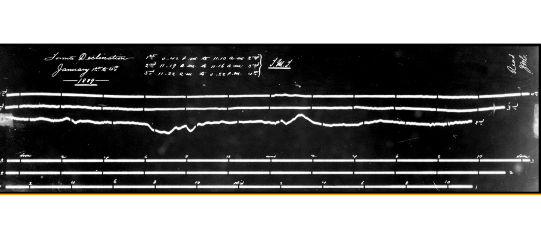

class: inverse

```{r include=FALSE}
library(ggplot2)
filter <- dplyr::filter
knitr::opts_chunk$set(warning=FALSE, message=FALSE, fig.width=10.5, fig.height=4, 
  comment=NA, rows.print=16)
theme_set(theme_gray(base_size = 24))
```

## Reproducibility 

In this workshop, I am specifically interested in discussing ways in which to encourage
students to develop strong reproducible research **methods**, particularly with 
respect to their data gathering, manipulation, and analysis.

<br/>
I will gratefully leave the discussions of specific issues in general reproducibility
in the psychological sciences to domain experts. 

---

class: inverse

## Reproducible Research Methods

First published work I could find that referenced the specific framework I am
thinking of here (computational reproducibility) is 1992:

<br/>

J. Claerbout, M. Karrenbach, **Electronic documents give reproducible research a new meaning**, in Proceedings of the 62nd Annual International Meeting of the Society of Exploration Geophysics, New Orleans, USA, 25 to 29 October 1992.

---

class: inverse

## Reproducible Research Methods

Some quotes:

<br/>
* *a revolution in education and technology transfer follows from the marriage of word processing and software command scripts*
* *researchers ... can reproduce their own research results a year or more later by "pressing a single button"*
* *Our basic goal is reproducible research. The electronic document is our means to this end*

<br/>
https://doi.org/10.1190/1.1822162

---

class: inverse

## Definition

<br/>
... the idea that scientific results should be documented in such a way that their deduction is fully transparent. This requires a detailed description of the methods used to obtain the data and making the full dataset and the code to calculate the results easily accessible.
**This is the essential part of open science.**

<br/>
*Wikipedia, https://en.wikipedia.org/wiki/Reproducibility*

---

class: inverse

## Some Necessary Components

To make any research project computationally reproducible

* all data and files clearly:
    - separated
    - labelled
    - documented
* all operations should be automated as much as practicable, avoiding manual intervention 
* workflow designed as a sequence of steps (scripts!), combined so intermediate outputs from one step directly feed in as inputs to the next
* version control should be used

---

class: inverse

## Workflow Includes

* data acquisition
* data processing
    - entry
    - manipulation
    - filtering
* data analysis
    - computation of statistics
    - figures
    - model-fitting (including interim steps!) - avoid The Garden of Forking Paths!
    - linear flow, resist urge to modify earlier steps (PHARKing)
* actually software engineering!


---

## An Example of One Sample

<center>

</center>

---

layout: false
class: inverse, middle

<center>
<a href="http://www.trentu.ca/math/"></a> &emsp;&emsp;
<a href="https://creativecommons.org/licenses/by/4.0/"></a>
</center>

- Contact me: [Email](mailto:wesleyburr@trentu.ca) or [Twitter](https://twitter.com/wsburr)
- Slides created via the R package [xaringan](https://github.com/yihui/xaringan) by Yihui Xie
- Slides available at [GitHub](https://wesleyburr.github.io/TeachingStatsPsych/#1)
<br/>
